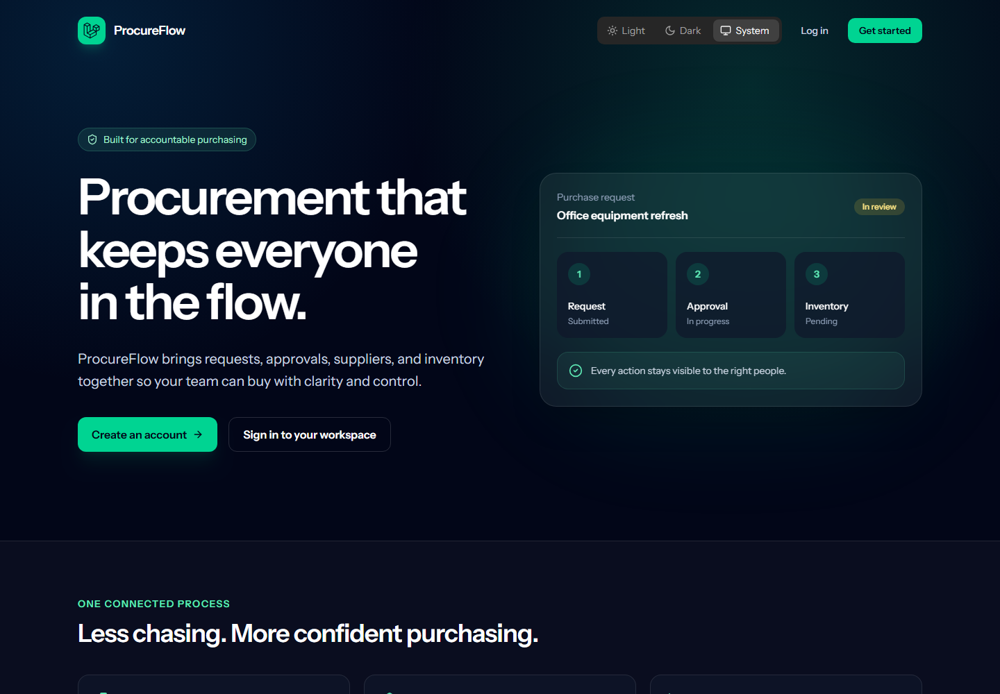
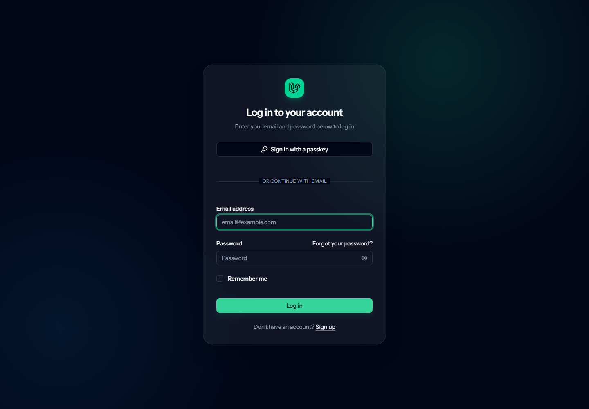

# ProcureFlow

ProcureFlow is a role-based procurement and inventory management system that brings product discovery, purchase requests, approvals, suppliers, and stock information into one accountable workflow.

Built as a full-stack portfolio project with Laravel, React, Inertia, and TypeScript, it demonstrates authentication, authorization, relational data modeling, workflow state changes, responsive interfaces, validation, and automated testing.



## What the system does

ProcureFlow replaces disconnected purchasing conversations with a clear process:

1. A requester browses the product catalog and creates a purchase request.
2. The requester submits the completed request for review.
3. An approver reviews the requested items, then approves or rejects the request with remarks.
4. Inventory officers maintain the categories, products, stock thresholds, and supplier records that support the workflow.
5. Administrators oversee the system and can access every operational area.

## Main features

- Secure registration, login, password reset, email verification, passkeys, and two-factor authentication
- Role-based access for administrators, requesters, approvers, and inventory officers
- Role-aware dashboard with procurement summaries and recent activity
- Searchable requester catalog with product availability details
- Draft purchase requests with multiple line items, quantities, and required dates
- Submit, approve, and reject workflow with status history and review remarks
- Category management with protection against deleting categories that are in use
- Product management with images, SKU, unit, price, availability, and reorder levels
- Supplier and contact management
- Profile, avatar, password, appearance, passkey, and security settings
- Responsive light and dark interfaces
- Server-side validation, authorization policies, pagination, filters, and database transactions
- Automated feature, authorization, validation, and workflow tests

## Screenshots

### Landing page


### Authentication



## Roles and permissions

| Area | Administrator | Requester | Approver | Inventory officer |
| --- | :---: | :---: | :---: | :---: |
| Dashboard | Yes | Yes | Yes | Yes |
| Catalog | Yes | Yes | No | No |
| Purchase requests | Yes | Yes | No | No |
| Approval queue | Yes | No | Yes | No |
| Categories | Yes | No | No | Yes |
| Products | Yes | No | No | Yes |
| Suppliers | Yes | No | No | Yes |

## Technology

| Layer | Technology |
| --- | --- |
| Backend | PHP 8.3+, Laravel 13 |
| Frontend | React 19, TypeScript, Inertia.js 3 |
| Styling | Tailwind CSS 4, Radix UI, Lucide icons |
| Authentication | Laravel Fortify, passkeys, 2FA |
| Routing | Laravel Wayfinder typed routes |
| Database | SQLite for local development; MySQL/MariaDB supported |
| Build tooling | Vite 8 |
| Testing | Pest 4, PHPUnit, Laravel test utilities |

## Architecture

The application uses Laravel as the web server and source of truth. Controllers load and validate domain data, authorization middleware protects role-specific routes, and Inertia delivers Laravel responses directly to React pages without a separate REST API. React provides the interactive interface while Laravel retains routing, sessions, authentication, validation, and database access.

```text
Browser
  -> Laravel routes and role middleware
    -> Controllers and validation
      -> Eloquent models and database
    -> Inertia response
      -> React and TypeScript pages
```

## Local installation

### Requirements

- PHP 8.3 or newer
- Composer
- Node.js 20 or newer and npm
- SQLite, MySQL, or MariaDB

### Setup

```bash
git clone <your-repository-url>
cd procureflow
composer install
cp .env.example .env
php artisan key:generate
npm install
php artisan migrate --seed
composer run dev
```

On Windows PowerShell, create the environment file with:

```powershell
Copy-Item .env.example .env
```

Open `http://localhost:8000` after the development services start.

## Demo accounts

Run `php artisan migrate --seed` to create the demo data. Every demo account uses the password `password`.

| Role | Email |
| --- | --- |
| Administrator | `admin@procureflow.test` |
| Requester | `requester@procureflow.test` |
| Approver | `approver@procureflow.test` |
| Inventory officer | `inventory@procureflow.test` |

> Demo credentials are for local or portfolio environments only. Replace or remove them before exposing a production instance.

## Quality checks

```bash
php artisan test
npm run lint:check
npm run format:check
npm run types:check
npm run build
composer run lint:check
```

The current automated suite contains 125 passing tests and 560 assertions covering authentication, role access, master data, purchase requests, approvals, settings, and validation behavior.

## Deployment

ProcureFlow is not a static React application. Inertia depends on a running Laravel application for every route, authenticated session, validation response, and database query. The complete system therefore needs a host with:

- PHP 8.3 or newer and required PHP extensions
- A persistent SQL database
- Writable storage or an object-storage disk for uploaded product images
- A web process pointing to Laravel's `public` directory
- A queue worker when queued work is enabled

Recommended deployment flow:

```bash
composer install --no-dev --optimize-autoloader
npm ci
npm run build
php artisan migrate --force
php artisan storage:link
php artisan config:cache
php artisan route:cache
php artisan view:cache
```

Set `APP_ENV=production`, `APP_DEBUG=false`, a secure `APP_KEY`, the public `APP_URL`, production database credentials, and the appropriate mail, cache, session, queue, and filesystem values in the hosting provider.

### About Netlify

Netlify can run the Vite build and serve static assets, but the ProcureFlow application also requires Laravel's persistent PHP runtime and database-backed sessions. Publishing only the generated frontend assets would produce a non-functional application. Deploy the full app to a Laravel-capable service; Netlify can still be used for a separate static marketing site if one is added later.

## Project structure

```text
app/                    Laravel domain, controllers, middleware, and models
database/               Migrations, factories, and demo seeders
resources/js/           Inertia React pages, layouts, components, and types
resources/css/          Tailwind application styles
routes/                  Web, authentication, and settings routes
tests/                   Pest feature and unit tests
docs/screenshots/        Images used by this README
```

## License

This project is released under the MIT license declared in `composer.json`.
